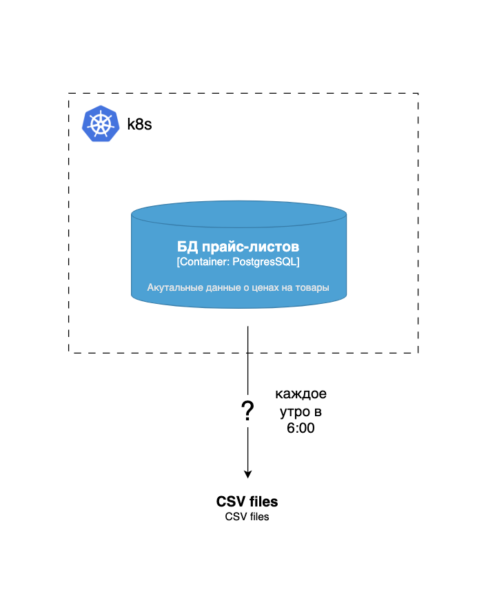
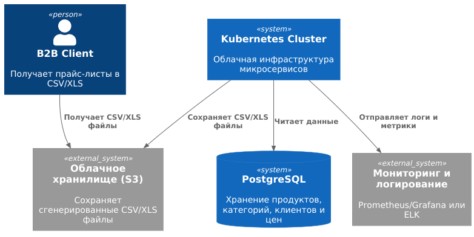

| Критерий                                                           | Spring Batch                                        | Apache Airflow                              | K8s Job                                       | Spark                         |
|--------------------------------------------------------------------|-----------------------------------------------------|---------------------------------------------|-----------------------------------------------|-------------------------------|
| **Наличие конфигурации CRON-расписания**                           | Да, через встроенные `@Scheduled` или `JobLauncher` | Да, DAG + `schedule_interval`               | Да, через CronJob Kubernetes                  | Ограниченно                   |
| **Сложность реализации логики по обработке данных**                | Низкая, простые SQL-запросы + CSV экспорт           | Средняя, требует написания DAG и операторов | Низкая, просто контейнер с скриптом           | Высокая, сложно для 10k строк |
| **Ресурсоёмкость решения**                                         | Средняя (JVM)                                       | Средняя (Scheduler + Worker)                | Низкая (запускается только job)               | Высокая (кластеры Spark)      |
| **Масштабируемость под нагрузкой**                                 | Высокая, но избыточная для текущей задачи           | Высокая, подходит для больших DAG           | Высокая горизонтально, легко масштабировать   | Высокая                       |
| **Сложность развёртывания в облаке и интеграция с микросервисами** | Средняя (нужен сервис/контейнер)                    | Высокая (Airflow кластер)                   | Низкая (K8s CronJob)                          | Высокая (кластеры)            |
| **Удобство интеграции с логированием и мониторингом**              | Высокое, можно интегрировать с ELK, Prometheus      | Высокое                                     | Высокое, контейнеры логируются самостоятельно | Среднее                       |


Вывод:
Для текущей задачи оптимально использовать Kubernetes CronJob, который запускает контейнер 
с простым скриптом на Python для генерации CSV т.к:
- малый объём данных 
- легко интегрировать в микросервисную облачную инфраструктуру.
- Простое логирование и мониторинг через стандартные K8s инструменты.
- CRON-scheduler уже встроен


AS IS
- 


TO BE



**Верхнеуровневый план реализации**

Шаг 1. Подготовка SQL-запроса


Написать SQL-запрос, который объединяет таблицы:
products, categories, clients, client_prices.

```
SELECT c.id AS client_id,
       c.name AS client_name,
       p.id AS product_id,
       p.name AS product_name,
       cat.name AS category_name,
       cp.price AS client_price
FROM client_prices cp
JOIN clients c ON cp.client_id = c.id
JOIN products p ON cp.product_id = p.id
JOIN categories cat ON p.category_id = cat.id;
```


Шаг 2. Разработка скрипта генерации CSV/XLS

Написать скрипт generate_csv.py на Python который выполняет подготовленный SQL на Postgresql и формирует CSV файлы

Шаг 3. Упаковка в кокнтейнер

```
FROM python:3.12-slim
WORKDIR /app
COPY requirements.txt .
RUN pip install -r requirements.txt
COPY generate_csv.py .
CMD ["python", "generate_csv.py"]
```


Шаг 4. Настройка K8s CronJob

Создать CronJob для запуска контейнера ежедневно в 6:00:
```
apiVersion: batch/v1
kind: CronJob
metadata:
  name: b2b-csv-export
spec:
  schedule: "0 6 * * *"
  jobTemplate:
    spec:
      template:
        spec:
          containers:
          - name: csv-generator
            image: <image_name>:latest
            env:
            - name: DB_HOST
              value: "postgres-service"
            - name: DB_USER
              valueFrom: ...
          restartPolicy: OnFailure

```


Шаг 5. Интеграция с облачным хранилищем

Сохранять файлы в облако для дальнейшего доступа клиентов.


Шаг 6. Логирование и мониторинг

- Логи контейнера автоматически собираются K8s (kubectl logs).
- Для метрик и алертов подключить Prometheus/Grafana или ELK Stack.